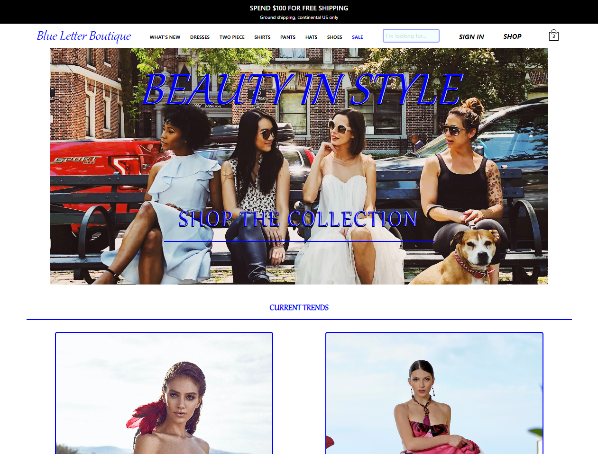

# Blue Letter Boutique

## Front End SPA Web Application

## Description

Blue Letter Boutique is an E-commerce Single Page Application where users can browse and purchase a variety of clothing items.

## Table of Contents

-   [Blue Letter Boutique](#blue-letter-boutique)
    -   [Front End SPA Web Application](#front-end-spa-web-application)
    -   [Description](#description)
    -   [Table of Contents](#table-of-contents)
    -   [Purpose](#purpose)
    -   [Usage](#usage)
        -   [IMPORTANT](#important)
    -   [Technologies](#technologies)
    -   [License](#license)
    -   [About](#about)
    -   [Badges](#badges)

## Purpose

I need to advance my skills with Front End Technologies so I can be a more enticing candidate when potential employers are considering adding a member to their team. I completed the [University of Arizona's Coding Bootcamp](./src/assets/app-screenshot/Full-Stack-Web-Development-University-of-Arizona-Badging.png) and have been completing courses on Udemy/LinkedIn Learning (to keep up my skills) while looking for a job. Blue Letter Boutique, inspired by [Red Dress](https://www.reddress.com/), was built to show off what I've learned so far.

## Usage

[Blue Letter Boutique](https://glittering-brigadeiros-85868e.netlify.app/) (referred to as BLB) is an E-commerce website and behaves as such. Click the link and you'll be taken to BLB's website where you can:

-   1. Create an account
-   2. Sign In if you have an existing account
-   3. Contact Customer support through email
-   4. Reset user password if needed
-   5. Browse multiple categories of clothing
-   6. Add items to a cart
-   7. View the cart
-   8. TEST purchase the cart items using Stripes test card number

### IMPORTANT

I DID NOT setup this website for users to make actual purchases. Parting with money is THE most important interaction a user will have with an E-commerce site. As this is NOT an actual online store I have NOT turned on actual payments. \
If you wish to test the Credit Card component enter in \
4242 4242 4242 4242 for the Card number. \
Set the expiration date to anytime in the FUTURE. \
The CVV and Zip Code can be any number. \

## Technologies

This SPA Application uses:

-   Stripe for payments
-   React for the Front End Library
-   Netlify for deployment
-   Google Firebase for database
-   Google Login for user authentication
-   DotEnv for environment
-   ImageKit.io for my Content Delivery Network
-     - This is where I store all of my images for my database (Google Firebase) to reference

## License

MIT License

Copyright (c) [2023] [David Whipple]

Permission is hereby granted, free of charge, to any person obtaining a copy of this software and associated documentation files (the "Software"), to deal in the Software without restriction, including without limitation the rights to use, copy, modify, merge, publish, distribute, sublicense, and/or sell copies of the Software, and to permit persons to whom the Software is furnished to do so, subject to the following conditions:

The above copyright notice and this permission notice shall be included in all copies or substantial portions of the Software.

THE SOFTWARE IS PROVIDED "AS IS", WITHOUT WARRANTY OF ANY KIND, EXPRESS OR IMPLIED, INCLUDING BUT NOT LIMITED TO THE WARRANTIES OF MERCHANTABILITY, FITNESS FOR A PARTICULAR PURPOSE AND NONINFRINGEMENT. IN NO EVENT SHALL THE AUTHORS OR COPYRIGHT HOLDERS BE LIABLE FOR ANY CLAIM, DAMAGES OR OTHER LIABILITY, WHETHER IN AN ACTION OF CONTRACT, TORT OR OTHERWISE, ARISING FROM, OUT OF OR IN CONNECTION WITH THE SOFTWARE OR THE USE OR OTHER DEALINGS IN THE SOFTWARE.

## About

Hello, my name is David \
You can email me at dwhipp88@gmail.com \
You can view my [github](https://github.com/D-Whipp). \
Check out my [portfolio](http://mighty-brook-32674.herokuapp.com/). \
Let's make a connection! [LinkedIn](https://www.linkedin.com/in/david-w-079841213/) \

## Badges

